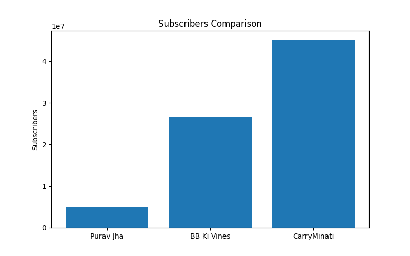
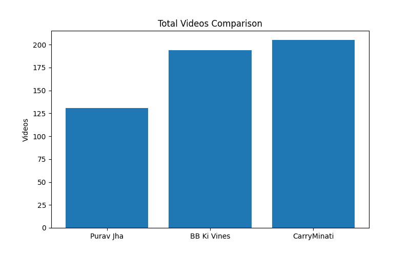
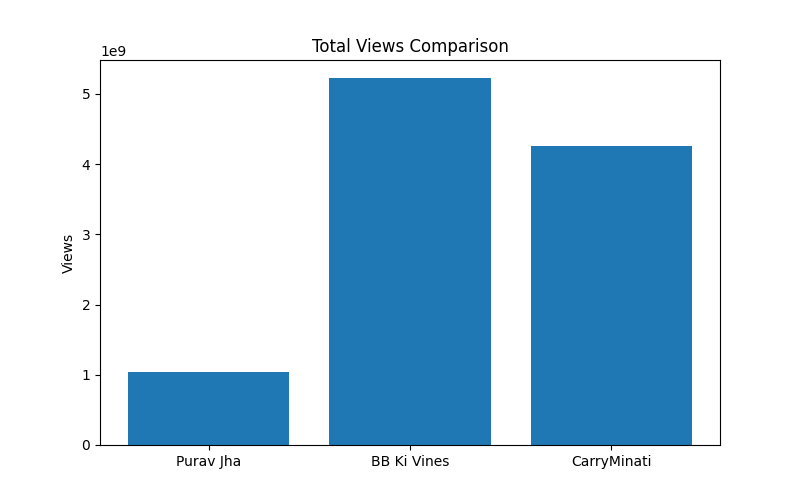

# 📊 YouTube Channel Analytics Report

This project analyzes and compares the performance of three popular
YouTube channels --- **Purav Jha**, **BB Ki Vines**, and **CarryMinati**
--- based on their **Subscribers**, **Total Videos**, and **Total
Views**.

Author: **Mayank Singh**

------------------------------------------------------------------------

## 📌 Project Overview

The project gathers and visualizes YouTube analytics data to provide a
comparative analysis of:\
- **Subscriber Growth**\
- **Content Uploads (Total Videos)**\
- **Audience Reach (Total Views)**

The data has been represented using bar charts for better clarity.

------------------------------------------------------------------------

## 📈 Data Summary

  Channel             Subscribers   Total Videos     Total Views
  ----------------- ------------- -------------- ---------------
  **Purav Jha**         5,040,000            131   1,036,882,926
  **BB Ki Vines**      26,600,000            194   5,222,698,754
  **CarryMinati**      45,100,000            205   4,252,520,897

------------------------------------------------------------------------

## 📊 Visual Comparisons

### 1️⃣ Subscribers Comparison

### 2️⃣ Total Videos Comparison

### 3️⃣ Total Views Comparison

------------------------------------------------------------------------

## 📜 Report PDF

For detailed insights, check the full report here:\
📄 [YouTube_Report.pdf](YouTube_Report.pdf)

------------------------------------------------------------------------

## 🚀 How to Use

1.  Open the **Jupyter Notebook (`.ipynb`)** file to view the analysis
    process.\
2.  View the generated charts in `.png` format.\
3.  Read the full **PDF Report** for a consolidated summary.

------------------------------------------------------------------------

## 🧑‍💻 Author

**Mayank Singh**

🔗 GitHub: [MayankSingh1111](https://github.com/MayankSingh1111)
